# Lab: Fan-out Architecture with SNS, SQS and Lambda

## Objetivo

Este laboratório teve como objetivo implementar uma arquitetura fan-out na AWS usando Amazon SNS, Amazon SQS e AWS Lambda para processar eventos de pedidos de um e-commerce de forma assíncrona, paralela e desacoplada.

A proposta foi simular um cenário em que um único evento de pedido publicado em um tópico SNS aciona diferentes fluxos de processamento, como atualização de estoque, processamento de pagamento, notificação ao cliente e análise de fraude.

## Cenário

O ambiente simula uma aplicação de e-commerce orientada a eventos. Quando um novo pedido é criado, a aplicação publica uma mensagem no tópico SNS `ecommerce-orders-topic`. A partir desse ponto, o SNS distribui o mesmo evento para diferentes assinaturas, permitindo que cada componente processe a mensagem de forma independente.

Cada consumidor representa uma responsabilidade do fluxo de pedidos:

- Atualizar inventário
- Processar pagamento
- Notificar cliente
- Analisar fraude

Para tornar o fluxo mais próximo de um cenário real, foram configuradas políticas de filtro nas assinaturas SNS, uma fila SQS para desacoplar a análise de fraude e uma Dead Letter Queue para armazenar mensagens que não forem processadas com sucesso.

Serviços utilizados:

- Amazon SNS
- Amazon SQS
- AWS Lambda
- AWS IAM
- Amazon CloudWatch Logs

## Arquitetura

A arquitetura utiliza o tópico SNS `ecommerce-orders-topic` como ponto central de publicação dos eventos de pedido. Esse tópico possui assinaturas para funções Lambda e para uma fila SQS.

As funções `lambda-inventory`, `lambda-payment` e `lambda-customer-notification` são acionadas diretamente pelo SNS de acordo com suas políticas de filtro. Já a função `lambda-fraud-analysis` recebe mensagens por meio da fila SQS `fraud-analysis-queue`, permitindo maior desacoplamento, controle de retentativas e envio para uma DLQ em caso de falha.

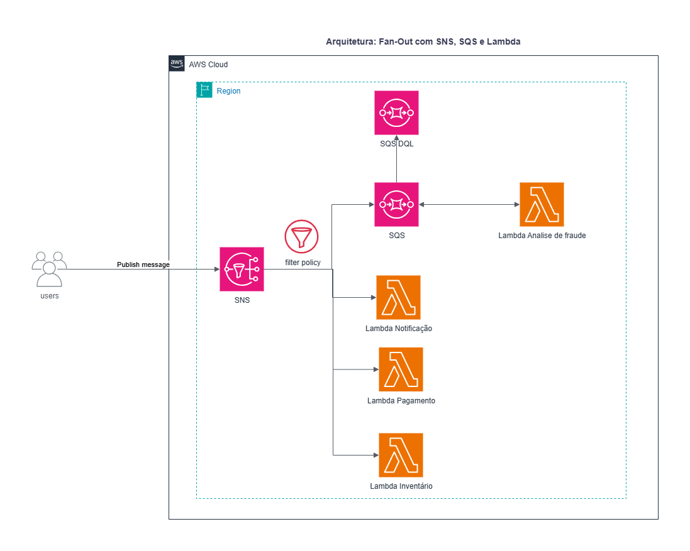

## Etapas Realizadas

### 1. Criação da Dead Letter Queue para análise de fraude

Foi criada uma Dead Letter Queue para armazenar mensagens que não forem processadas corretamente pelo fluxo de análise de fraude após o limite de tentativas configurado.

Configurações principais:

- Nome da fila: `dlq-fraud-analysis`
- Tipo: Standard
- Uso: receber mensagens com falha de processamento da fila principal de fraude

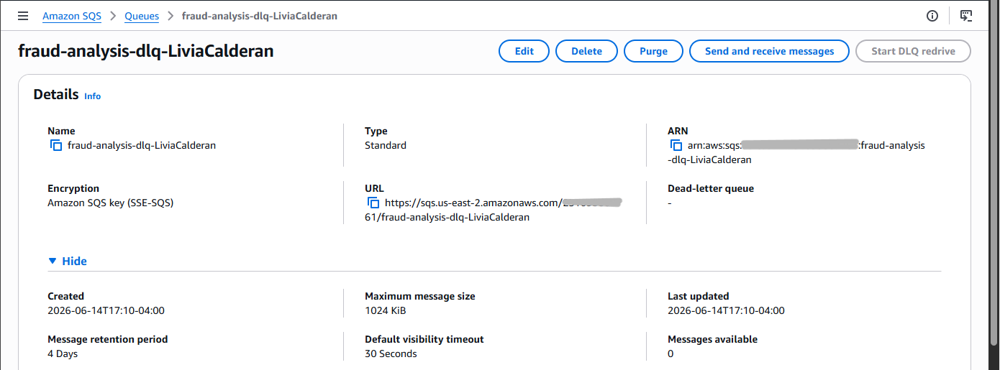

### 2. Criação da fila SQS principal para análise de fraude

Foi criada a fila SQS `fraud-analysis-queue` para receber, de forma assíncrona, os pedidos que precisam passar por análise de fraude.

Configurações principais:

- Nome da fila: `fraud-analysis-queue`
- Tipo: Standard
- Dead-letter queue: habilitada
- DLQ associada: `dlq-fraud-analysis`
- Maximum receives: `3`

Com essa configuração, uma mensagem que falhar três vezes durante o processamento é encaminhada para a DLQ.

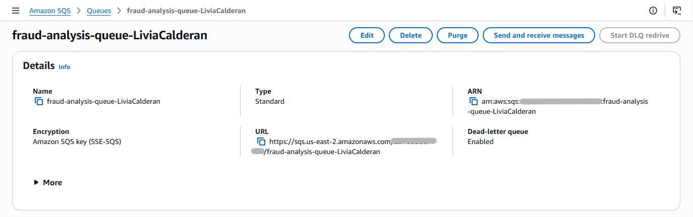

### 3. Criação do tópico SNS

Foi criado um tópico SNS Standard para centralizar a publicação dos eventos de pedidos do e-commerce.

Configurações principais:

- Nome do tópico: `ecommerce-orders-topic`
- Tipo: Standard
- Finalidade: receber eventos de novos pedidos e distribuí-los para múltiplos consumidores

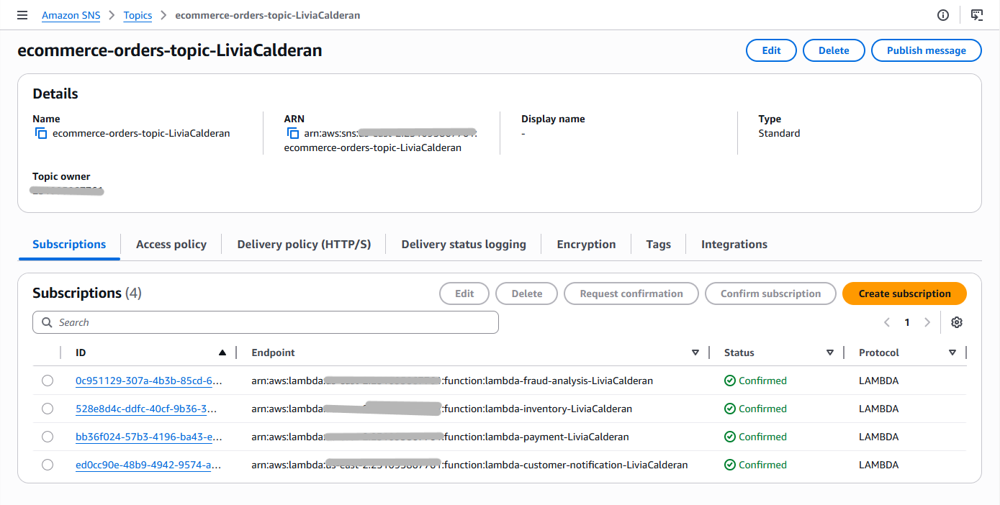

### 4. Criação das roles IAM para Lambda

Foram criadas roles IAM para permitir que as funções Lambda executassem suas ações com as permissões necessárias.

A role `lambda-role-sns-generic` foi usada pelas Lambdas acionadas diretamente pelo SNS:

- Política anexada: `AWSLambdaBasicExecutionRole`
- Finalidade: permitir execução da Lambda e escrita de logs no CloudWatch

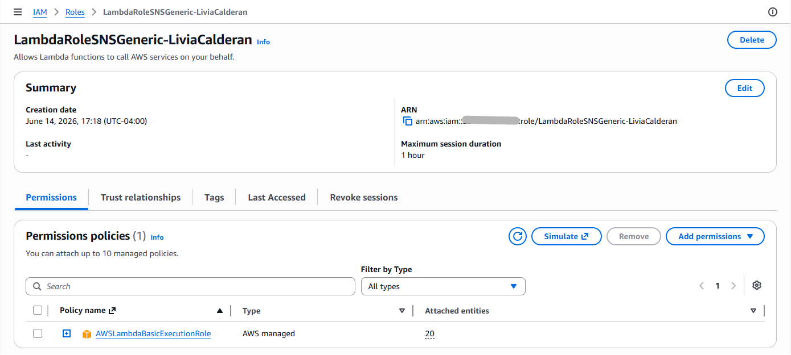

A role `lambda-role-sqs-fraud` foi usada pela Lambda de análise de fraude, que consome mensagens da SQS:

- Políticas anexadas: `AWSLambdaBasicExecutionRole` e `AmazonSQSFullAccess`
- Finalidade: permitir execução da Lambda, escrita de logs e consumo de mensagens da fila SQS

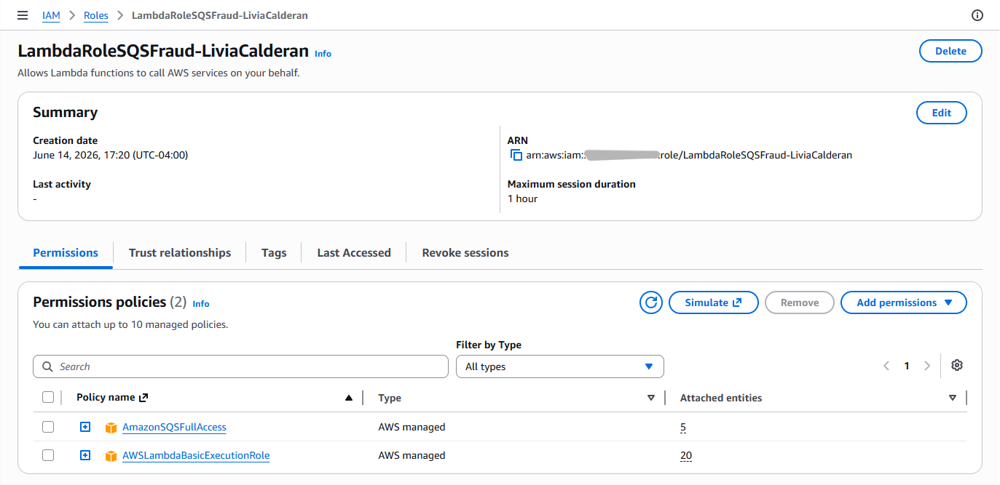

### 5. Criação da função Lambda de inventário

Foi criada a função `lambda-inventory`, responsável por simular a atualização de estoque quando um novo pedido é recebido.

Configurações principais:

- Nome da função: `lambda-inventory`
- Runtime: Python 3.12
- Role: `lambda-role-sns-generic`
- Entrada: evento recebido pelo SNS
- Atributos usados: `OrderID`

A função registra no CloudWatch o evento recebido e o pedido cujo inventário foi atualizado.

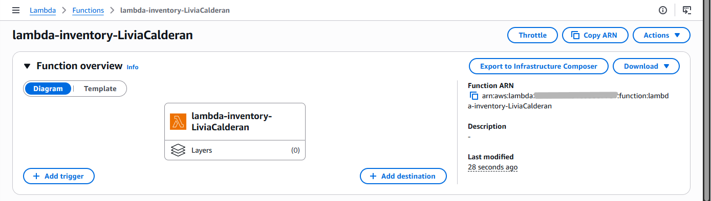

### 6. Criação da função Lambda de pagamento

Foi criada a função `lambda-payment`, responsável por simular o processamento de pagamento do pedido.

Configurações principais:

- Nome da função: `lambda-payment`
- Runtime: Python 3.12
- Role: `lambda-role-sns-generic`
- Entrada: evento recebido pelo SNS
- Atributos usados: `OrderID` e `PaymentType`

A função registra o tipo de pagamento e o pedido processado.

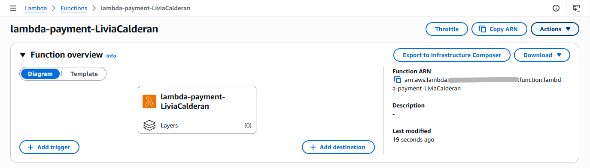

### 7. Criação da função Lambda de notificação ao cliente

Foi criada a função `lambda-customer-notification`, responsável por simular o envio de notificações ao cliente.

Configurações principais:

- Nome da função: `lambda-customer-notification`
- Runtime: Python 3.12
- Role: `lambda-role-sns-generic`
- Entrada: evento recebido pelo SNS
- Atributos usados: `OrderID` e `CustomerEmail`

Essa função representa notificações como confirmação de pedido ou atualização de envio.

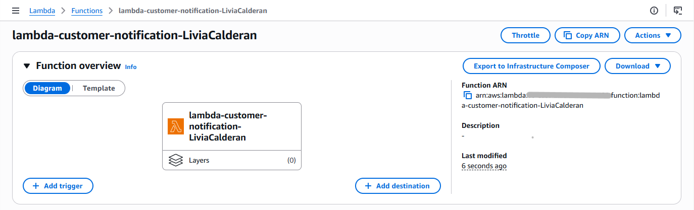

### 8. Criação da função Lambda de análise de fraude

Foi criada a função `lambda-fraud-analysis`, responsável por consumir mensagens da fila SQS `fraud-analysis-queue` e executar a lógica de análise de fraude.

Configurações principais:

- Nome da função: `lambda-fraud-analysis`
- Runtime: Python 3.12
- Role: `lambda-role-sqs-fraud`
- Entrada: mensagens recebidas da fila SQS
- Atributos usados: `OrderID` e `TransactionValue`

A Lambda lê o corpo da mensagem SQS, extrai a mensagem original publicada pelo SNS e registra no CloudWatch os dados analisados.

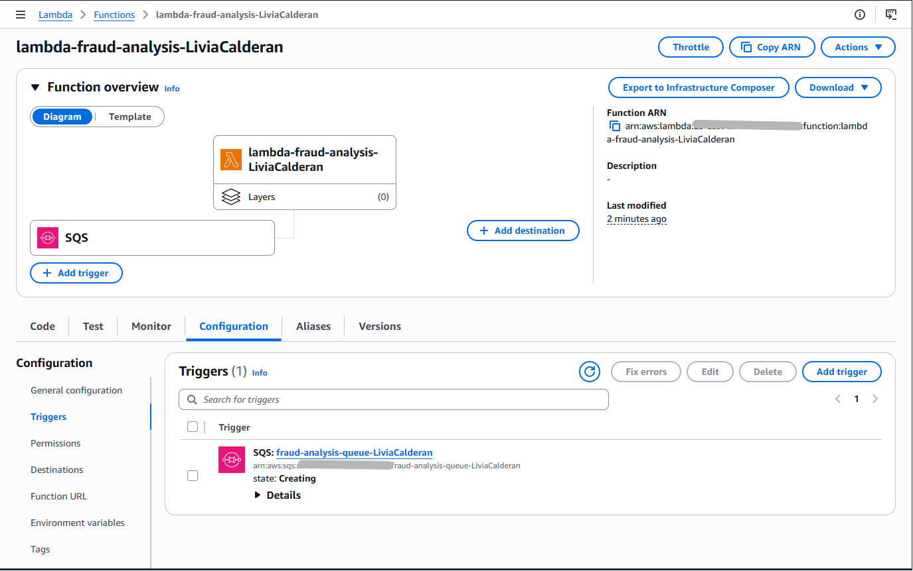

### 9. Configuração do gatilho SQS na Lambda de fraude

Na função `lambda-fraud-analysis`, foi configurado um gatilho SQS apontando para a fila principal de análise de fraude.

Configurações principais:

- Trigger: SQS
- Fila: `fraud-analysis-queue`
- Batch size: `1`

O batch size foi mantido em `1` para simplificar a leitura dos logs durante os testes.

### 10. Configuração das assinaturas SNS com filtros

Foram criadas assinaturas no tópico `ecommerce-orders-topic` para direcionar eventos apenas aos consumidores relevantes.

Assinatura da Lambda `lambda-inventory`:

```json
{
  "EventType": ["OrderPlaced", "InventoryCheckRequired"]
}
```

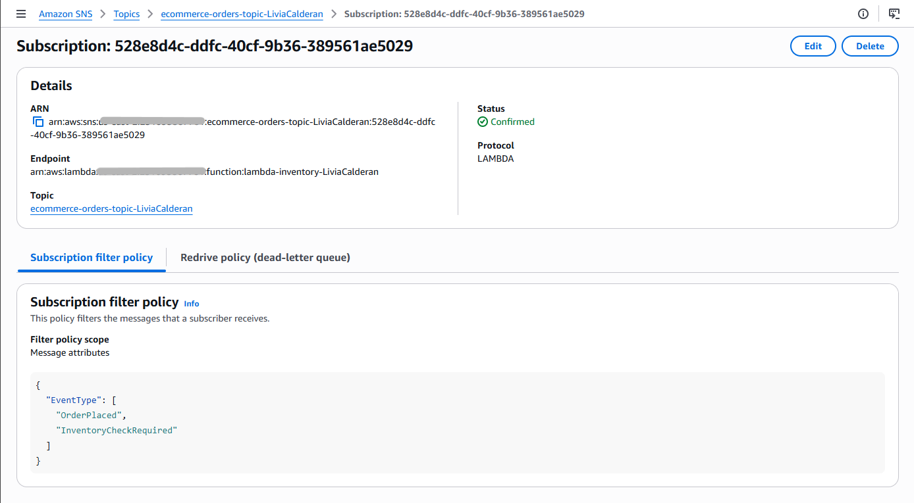

Assinatura da Lambda `lambda-payment`:

```json
{
  "EventType": ["OrderPlaced"],
  "PaymentType": ["CreditCard", "Boleto"]
}
```

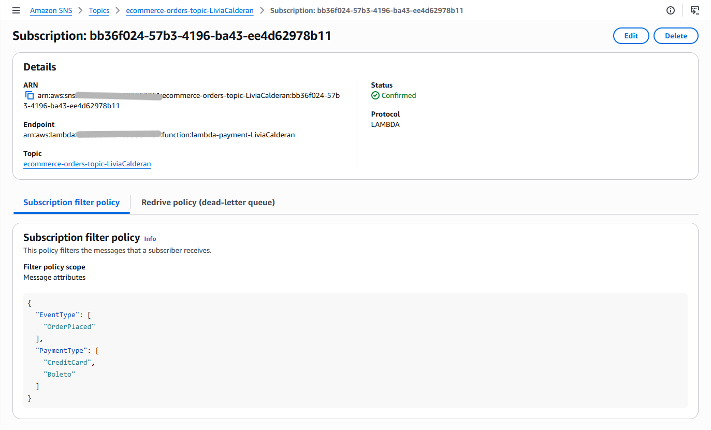

Assinatura da Lambda `lambda-customer-notification`:

```json
{
  "EventType": ["OrderConfirmed", "OrderShipped"]
}
```

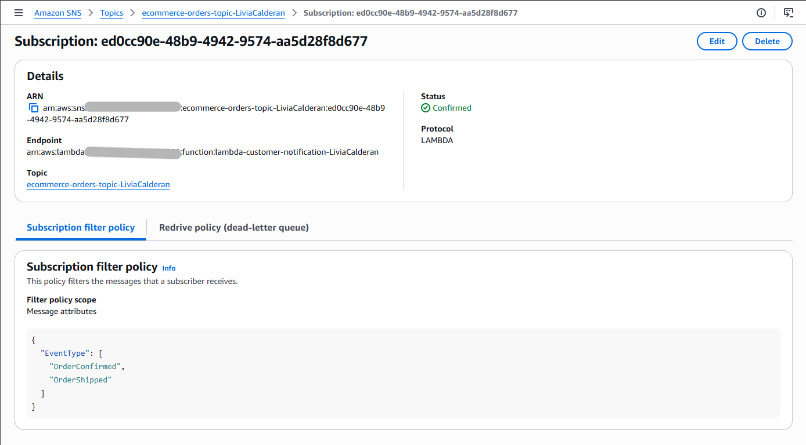

Assinatura da fila SQS `fraud-analysis-queue`:

```json
{
  "EventType": ["OrderPlaced"],
  "TransactionValue": [
    {
      "numeric": [">", 500]
    }
  ]
}
```

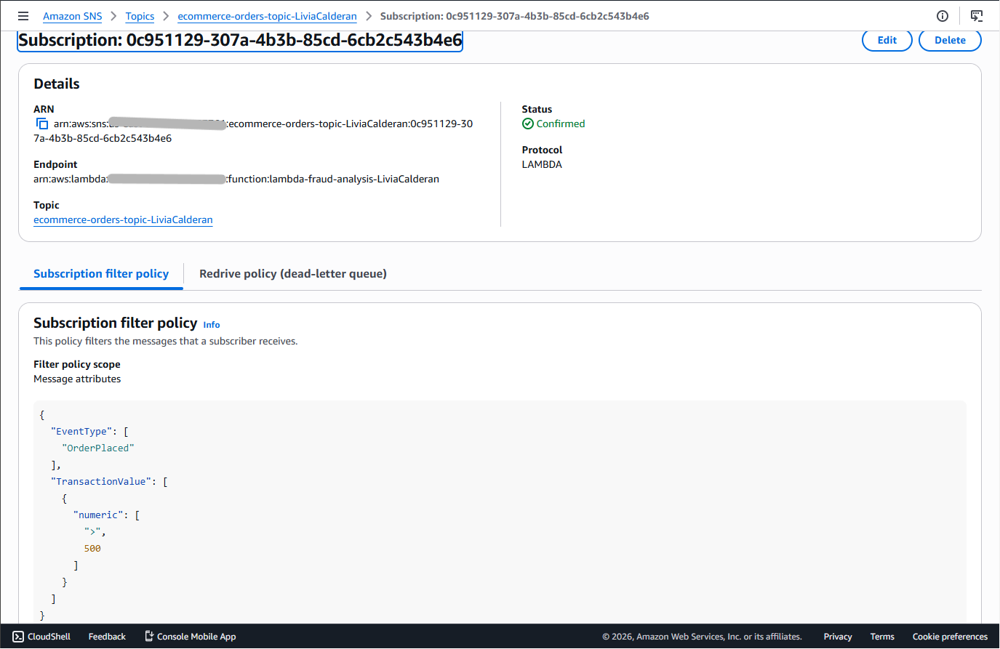

Com esses filtros, cada consumidor recebe apenas as mensagens compatíveis com sua responsabilidade.

### 11. Configuração da política de acesso da fila SQS

Foi verificada a política de acesso da fila `fraud-analysis-queue` para garantir que o tópico `ecommerce-orders-topic` tivesse permissão para enviar mensagens para ela.

A política permite a ação `sqs:SendMessage` para o serviço `sns.amazonaws.com`, restringindo a origem ao ARN do tópico SNS do laboratório.

Exemplo da política aplicada:

```json
{
  "Version": "2012-10-17",
  "Statement": [
    {
      "Effect": "Allow",
      "Principal": {
        "Service": "sns.amazonaws.com"
      },
      "Action": "sqs:SendMessage",
      "Resource": "ARN_DA_FILA_FRAUD_ANALYSIS_QUEUE",
      "Condition": {
        "ArnEquals": {
          "aws:SourceArn": "ARN_DO_TOPICO_ECOMMERCE_ORDERS_TOPIC"
        }
      }
    }
  ]
}
```

### 12. Publicação de mensagem de teste no SNS

Para validar o laboratório, foi publicada uma mensagem de teste no tópico `ecommerce-orders-topic` representando um pedido de e-commerce.

Corpo da mensagem:

```json
{
  "pedido_id": "PEDIDO-123",
  "cliente_id": "CLIENTE-XYZ",
  "itens": [
    {
      "produto_id": "PROD-A",
      "quantidade": 2
    },
    {
      "produto_id": "PROD-B",
      "quantidade": 1
    }
  ]
}
```

Para acionar os filtros, a publicação também utilizou atributos de mensagem como:

- `EventType`: `OrderPlaced`
- `PaymentType`: `CreditCard`
- `OrderID`: `PEDIDO-123`
- `CustomerEmail`: e-mail do cliente
- `TransactionValue`: valor numérico maior que `500`

### 13. Validação dos logs no CloudWatch

Após a publicação da mensagem, os logs das funções Lambda foram verificados no Amazon CloudWatch Logs.

Validações realizadas:

- A função `lambda-inventory` foi acionada por causa do atributo `EventType` igual a `OrderPlaced`.
- A função `lambda-payment` foi acionada por causa de `EventType` igual a `OrderPlaced` e `PaymentType` igual a `CreditCard`.
- A função `lambda-customer-notification` não foi acionada, pois seu filtro aceita apenas `OrderConfirmed` ou `OrderShipped`.
- A função `lambda-fraud-analysis` foi acionada após a mensagem passar pelo SNS, entrar na fila SQS `fraud-analysis-queue` e ser entregue para processamento.

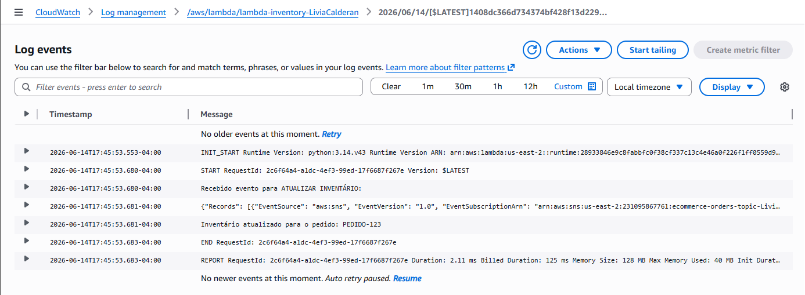

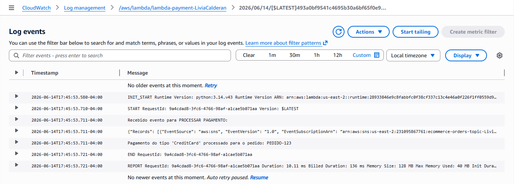

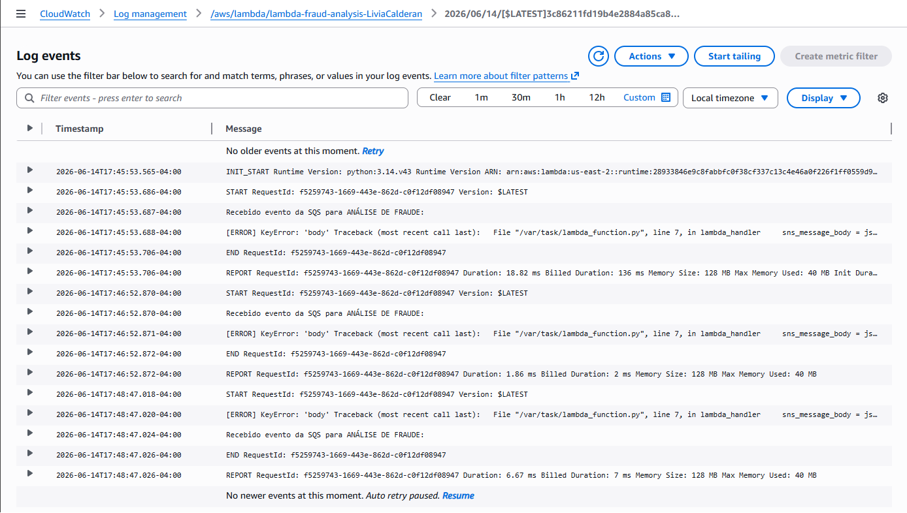

## Resultado

O laboratório foi concluído com sucesso. O tópico `ecommerce-orders-topic` distribuiu eventos para múltiplos consumidores, as políticas de filtro controlaram quais assinaturas deveriam receber cada mensagem e a fila `fraud-analysis-queue` desacoplou o fluxo de análise de fraude.

A integração entre SNS, SQS e Lambda demonstrou uma arquitetura orientada a eventos com processamento paralelo, isolamento entre consumidores, retentativas automáticas e suporte a Dead Letter Queue para tratamento de falhas.

## Conhecimentos Praticados

- Criação de tópico SNS Standard
- Publicação de mensagens com atributos no SNS
- Configuração de assinaturas SNS para AWS Lambda
- Configuração de assinatura SNS para Amazon SQS
- Uso de políticas de filtro em assinaturas SNS
- Criação de fila SQS Standard
- Configuração de Dead Letter Queue
- Integração entre SQS e Lambda por meio de trigger
- Criação e associação de roles IAM para Lambda
- Permissões para envio de mensagens do SNS para SQS
- Processamento assíncrono e desacoplado
- Validação de execuções por meio do Amazon CloudWatch Logs
- Aplicação do padrão fan-out em uma arquitetura serverless

## Conclusão

Este lab demonstrou como usar SNS, SQS e Lambda para construir uma arquitetura de e-commerce orientada a eventos. O padrão fan-out permitiu que um único evento de pedido fosse distribuído para diferentes fluxos de processamento, mantendo cada consumidor independente.

O uso de filtros de assinatura reduziu entregas desnecessárias, enquanto a fila SQS e a DLQ trouxeram mais resiliência para o processamento de análise de fraude. Essa combinação é útil para aplicações distribuídas que precisam escalar componentes de forma independente e lidar melhor com falhas temporárias.
