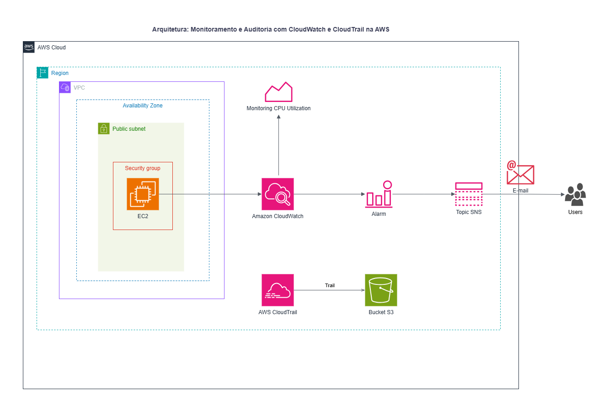
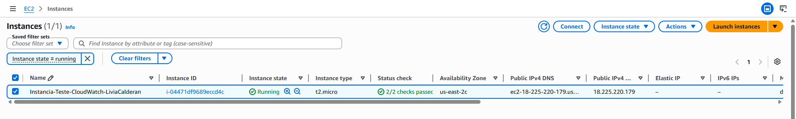
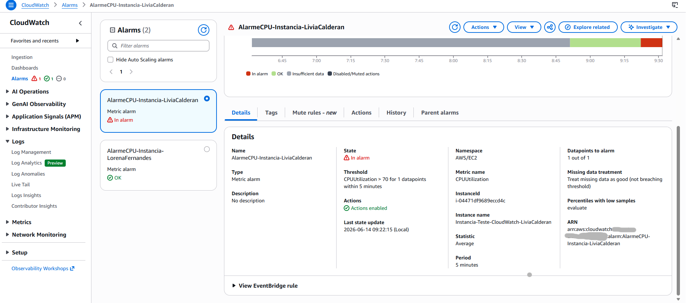
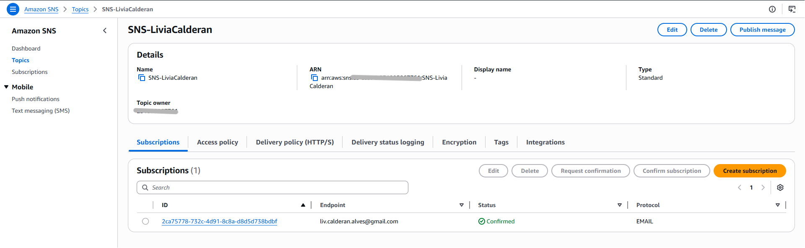
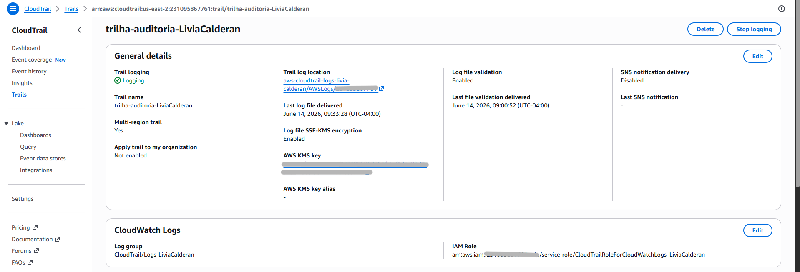
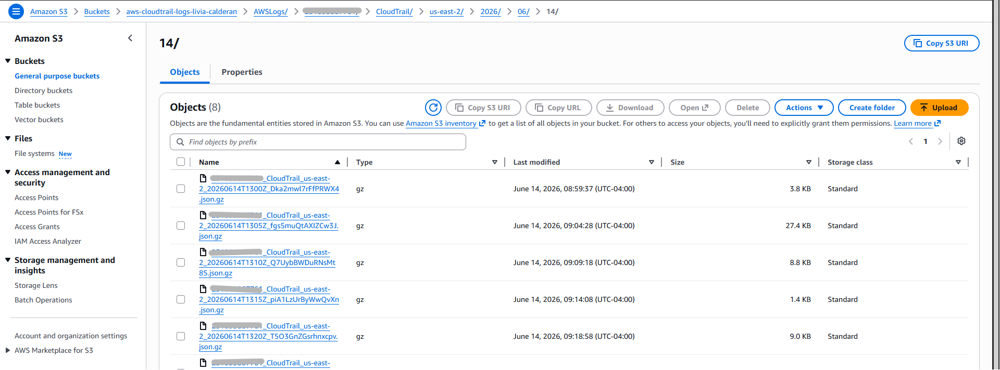
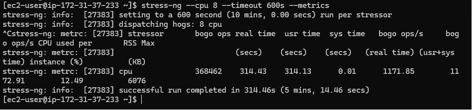
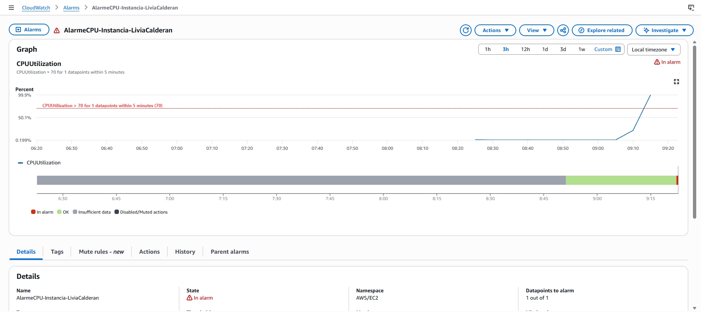
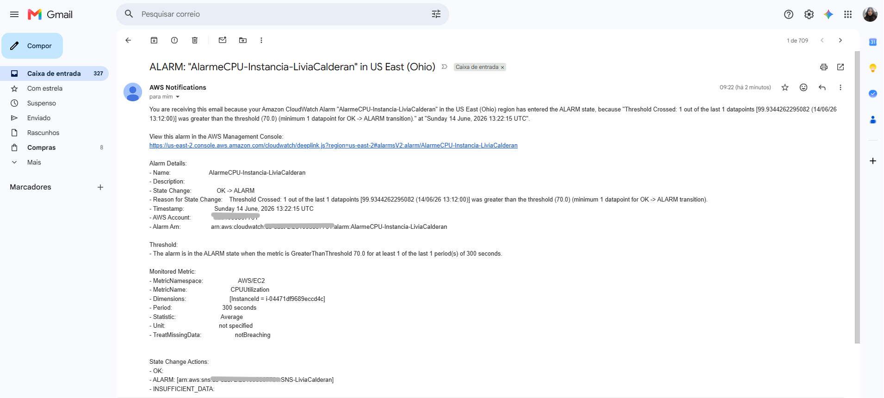

# Lab: Monitoring and Auditing with CloudWatch and CloudTrail

## Objetivo

Este laboratório teve como objetivo configurar monitoramento e auditoria em uma conta AWS, usando o Amazon CloudWatch para acompanhar a utilização de CPU de uma instância EC2 e o AWS CloudTrail para registrar eventos de atividade da conta.

Também foi configurada uma notificação via Amazon SNS para alertar quando a utilização de CPU ultrapassasse o limite definido.

## Cenário

O ambiente simula uma necessidade comum em produção: monitorar o desempenho de uma instância EC2 e manter rastreabilidade das ações realizadas na conta AWS para fins de segurança, auditoria e conformidade.

Para isso, foram utilizados os seguintes serviços:

- Amazon EC2
- Amazon CloudWatch
- Amazon SNS
- AWS CloudTrail
- Amazon S3
- AWS KMS
- WSL para acesso remoto via SSH

## Arquitetura

A arquitetura do laboratório conecta uma instância EC2 ao CloudWatch, que coleta métricas de CPU e dispara um alarme quando o limite configurado é atingido. O alarme aciona um tópico SNS, responsável por enviar a notificação por e-mail. Em paralelo, o CloudTrail registra eventos de gerenciamento da conta e armazena os logs em um bucket S3.



## Etapas Realizadas

### 1. Criação da instância EC2

Foi criada uma instância EC2 com Amazon Linux 2023, utilizando o tipo `t2.micro`. A instância recebeu IP público automático e um Security Group permitindo acesso SSH somente a partir do meu IP.

Configurações principais:

- Nome da instância: `Instancia-Teste-CloudWatch`
- AMI: Amazon Linux 2023
- Tipo: `t2.micro`
- Acesso: SSH
- Security Group: regra de entrada para SSH com origem restrita



### 2. Configuração do alarme no CloudWatch

No Amazon CloudWatch, foi criado um alarme com base na métrica `CPUUtilization` da instância EC2.

Configurações do alarme:

- Métrica: `CPUUtilization`
- Estatística: `Average`
- Período: `5 minutes`
- Condição: maior que `70%`
- Datapoints to alarm: `1 out of 1`
- Tratamento de dados ausentes: considerar como bom
- Ação: enviar notificação via SNS quando o estado for `In alarm`



### 3. Criação do tópico SNS

Foi criado um tópico SNS para envio de notificações por e-mail. Após criar o tópico, a assinatura foi confirmada pelo e-mail recebido.



### 4. Criação da trilha no CloudTrail

No AWS CloudTrail, foi criada uma trilha para registrar eventos de gerenciamento da conta AWS.

Configurações principais:

- Trail habilitada para eventos de gerenciamento
- Eventos de leitura e escrita habilitados
- Armazenamento dos logs em bucket S3
- Validação de arquivos de log habilitada
- Criptografia com chave KMS habilitada
- Eventos de dados, Insights e eventos de rede desabilitados



### 5. Verificação dos logs no Amazon S3

Após a criação da trilha, os logs do CloudTrail foram armazenados no bucket S3 configurado automaticamente durante o processo.

Os arquivos de auditoria ficam organizados em uma estrutura de pastas e são salvos no formato `.gz` contendo eventos JSON.



### 6. Acesso remoto pela instância via WSL

O acesso à instância EC2 foi feito via WSL, utilizando SSH com o par de chaves configurado durante a criação da instância.

Após acessar a instância, o sistema foi atualizado e a ferramenta `stress-ng` foi instalada:

```bash
sudo dnf update -y
sudo dnf install stress-ng -y
```

Em seguida, foi executado o teste de carga de CPU:

```bash
stress-ng --cpu 8 --timeout 600s --metrics
```



### 7. Validação do alarme no CloudWatch

Com o `stress-ng` em execução, a utilização de CPU da instância aumentou até ultrapassar o limite de 70%. Após o período de avaliação, o alarme mudou para o estado `In alarm`.



### 8. Recebimento da notificação por e-mail

Quando o alarme entrou no estado `In alarm`, o Amazon SNS enviou uma notificação para o e-mail inscrito no tópico.



## Resultado

O laboratório foi concluído com sucesso. A instância EC2 foi monitorada pelo CloudWatch, o alarme de CPU foi acionado corretamente após a geração de carga com `stress-ng`, a notificação foi enviada via SNS e o CloudTrail registrou eventos de auditoria da conta em um bucket S3.

## Conhecimentos Praticados

- Criação e configuração segura de uma instância EC2
- Acesso remoto à instância usando SSH via WSL
- Instalação e execução do `stress-ng` para simular alta utilização de CPU
- Criação de alarme no CloudWatch com base na métrica `CPUUtilization`
- Configuração de notificação automática com Amazon SNS
- Criação de trilha no AWS CloudTrail
- Armazenamento de logs de auditoria no Amazon S3
- Uso de criptografia com AWS KMS para logs do CloudTrail

## Conclusão

Este lab demonstrou como combinar monitoramento operacional e auditoria em um ambiente AWS. O CloudWatch permitiu acompanhar a saúde da instância e gerar alertas automáticos, enquanto o CloudTrail garantiu o registro das atividades realizadas na conta, fortalecendo a segurança e a governança do ambiente.
