# Lab: Semana do Desenvolvedor - Sistema Serverless de Pedidos

## Objetivo

Este laboratório teve como objetivo construir uma arquitetura serverless, desacoplada e orientada a eventos para ingestão, validação, processamento, persistência, alteração e cancelamento de pedidos na AWS.

A solução foi desenvolvida em quatro etapas, simulando um fluxo real de pedidos com múltiplas fontes de entrada: uma API REST para pedidos individuais e um bucket S3 para ingestão de arquivos JSON em lote.

## Cenário

O ambiente simula uma aplicação de pedidos que precisa receber dados por diferentes canais, validar as informações recebidas, publicar eventos de negócio, processar pedidos de forma assíncrona e manter o estado final em uma tabela DynamoDB.

O fluxo principal começa com o recebimento de pedidos via Amazon API Gateway. A requisição aciona uma função Lambda de pré-validação, que envia mensagens para uma fila SQS FIFO. Outra Lambda consome essa fila, valida os dados do pedido e publica o evento `NovoPedidoValidado` em um barramento customizado do Amazon EventBridge.

Além da API, o laboratório também adiciona um fluxo alternativo de ingestão por arquivos no Amazon S3. Quando um arquivo JSON é enviado ao bucket, uma notificação chega a uma fila SQS Standard, uma Lambda valida o arquivo, registra o histórico da validação no DynamoDB e envia os pedidos extraídos para a mesma fila FIFO usada pelo fluxo da API.

Por fim, regras do EventBridge direcionam eventos para filas SQS específicas, acionando Lambdas responsáveis pelo processamento central, cancelamento e alteração de pedidos.

Serviços utilizados:

- Amazon API Gateway
- AWS Lambda
- Amazon SQS FIFO
- Amazon SQS Standard
- Amazon EventBridge
- Amazon S3
- Amazon DynamoDB
- Amazon SNS
- AWS IAM
- Amazon CloudWatch Logs

## Arquitetura

A arquitetura utiliza o Amazon EventBridge como ponto central de roteamento dos eventos de negócio. As entradas via API Gateway e S3 são desacopladas por filas SQS e processadas por funções Lambda. Os pedidos validados são publicados no barramento `pedidos-event-bus`, onde regras específicas encaminham cada tipo de evento para sua fila e Lambda correspondente.

O DynamoDB é usado para persistir tanto o histórico de validação de arquivos quanto o estado principal dos pedidos. DLQs foram configuradas nas filas para capturar mensagens que falharem após o limite de tentativas.


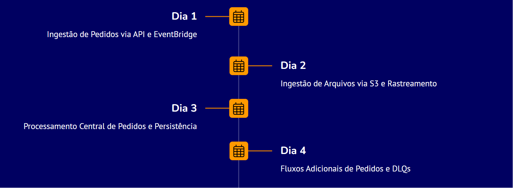

## Etapas Realizadas

### 1. Ingestão de pedidos via API Gateway

Foi criada uma API REST no Amazon API Gateway para receber pedidos pelo endpoint `/pedidos` usando o método `POST`.

Configurações principais:

- API: `pedidos-api-seu-nome`
- Tipo: REST API
- Endpoint: Regional
- Recurso: `/pedidos`
- Método: `POST`
- Integração: Lambda Proxy Integration
- Lambda integrada: `pre-validacao-lambda-seu-nome`
- Stage: `dev`

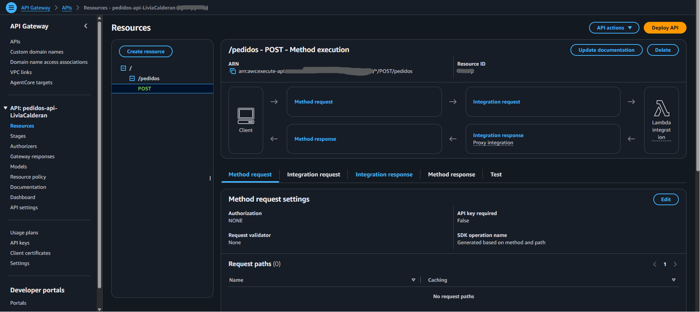

### 2. Criação da fila FIFO de pedidos

Foi criada uma fila SQS FIFO para desacoplar a entrada da API da validação detalhada dos pedidos, mantendo a ordem de processamento por `MessageGroupId`.

Configurações principais:

- DLQ: `pedidos-fifo-dlq-seu-nome.fifo`
- Fila principal: `pedidos-fifo-queue-seu-nome.fifo`
- Tipo: FIFO
- Maximum receives: `3`
- Uso: receber pedidos pré-validados pela API e pedidos extraídos de arquivos S3

### 3. Lambda de pré-validação

Foi criada a função `pre-validacao-lambda-seu-nome`, responsável por receber o evento do API Gateway, validar os campos obrigatórios e enviar o pedido para a fila SQS FIFO.

Configurações principais:

- Arquivo de código: `pre-validacao-lambda.py`
- Runtime: Python 3.12
- Variável de ambiente: `SQS_QUEUE_URL`
- Entrada: requisição HTTP do API Gateway
- Saída: mensagem na fila `pedidos-fifo-queue-seu-nome.fifo`
- Campos obrigatórios: `pedidoId` e `clienteId`

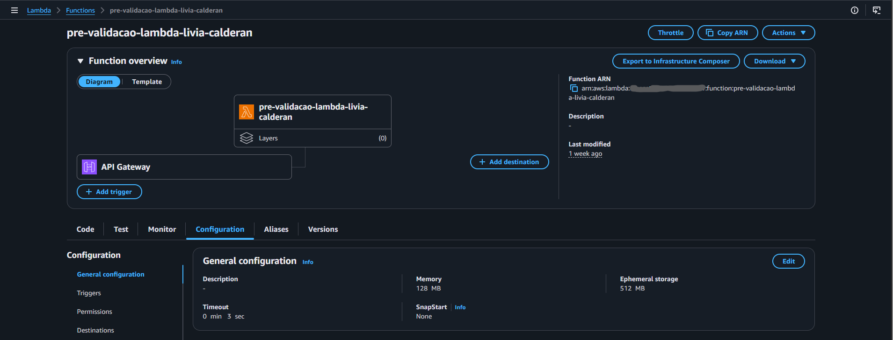

### 4. Barramento customizado no EventBridge

Foi criado um barramento customizado no Amazon EventBridge para centralizar os eventos do sistema de pedidos.

Configurações principais:

- Event bus: `pedidos-event-bus-seu-nome`
- Uso: receber eventos de pedidos validados e eventos operacionais de alteração e cancelamento

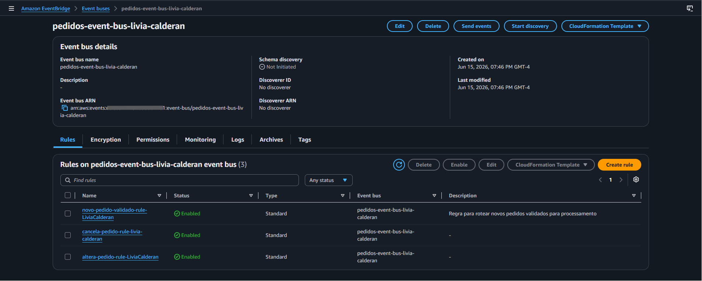

### 5. Lambda de validação de pedidos

Foi criada a função `validacao-pedidos-lambda-seu-nome`, acionada pela fila FIFO de pedidos. Essa Lambda valida se o pedido possui uma lista de itens válida e, em caso positivo, publica um evento no EventBridge.

Configurações principais:

- Arquivo de código: `validacao-pedidos-lambda.py`
- Runtime: Python 3.12
- Trigger: SQS FIFO `pedidos-fifo-queue-seu-nome.fifo`
- Batch size: `1`
- Variável de ambiente: `EVENT_BUS_NAME`
- Evento publicado:
  - `Source`: `lab.aula1.pedidos.validacao`
  - `DetailType`: `NovoPedidoValidado`

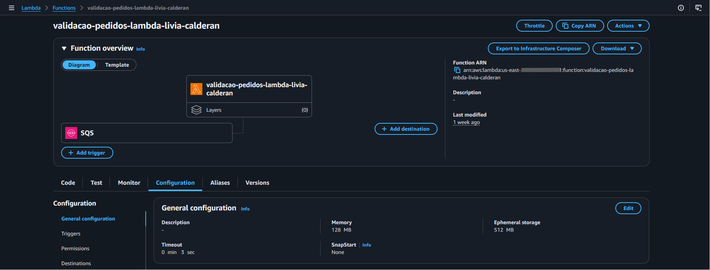

### 6. Ingestão de arquivos via Amazon S3

Foi criado um bucket S3 para receber arquivos JSON contendo listas de pedidos. Quando um novo arquivo é carregado, o S3 envia uma notificação para uma fila SQS Standard, que aciona a Lambda de validação de arquivos.

Configurações principais:

- Bucket: `datalake-arquivos-seu-nome`
- Fila principal: `s3-arquivos-json-queue-seu-nome`
- DLQ: `s3-arquivos-json-dlq-seu-nome`
- Tipo da fila: Standard
- Maximum receives: `3`
- Evento: criação de objeto no bucket S3

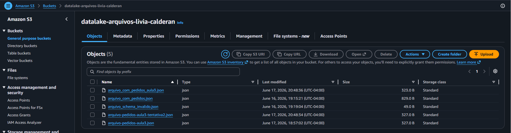

### 7. DynamoDB para histórico de arquivos

Foi criada uma tabela DynamoDB para registrar o resultado da validação dos arquivos enviados ao bucket S3.

Configurações principais:

- Tabela: `controle-arquivos-historico-seu-nome`
- Partition key: `nomeArquivo`
- Uso: armazenar status de validação, timestamp, bucket e detalhes de erro quando existirem

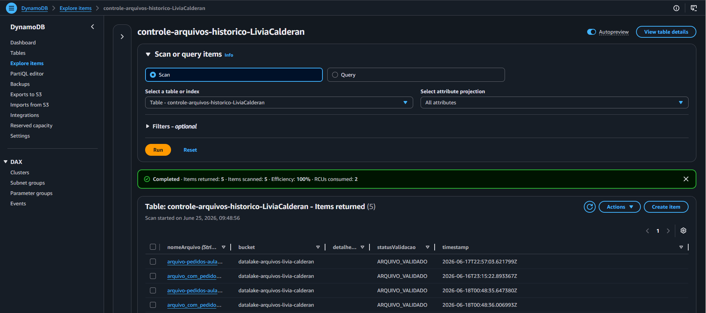

### 8. SNS para erros de validação de arquivos

Foi criado um tópico SNS para notificar erros de validação de arquivos. Quando um arquivo não possui JSON válido ou não segue o schema esperado, a Lambda publica uma mensagem nesse tópico.

Configurações principais:

- Tópico: `notificacao-erro-arquivos-seu-nome`
- Protocolo de assinatura: e-mail
- Uso: notificação de falhas no processamento de arquivos S3

### 9. Lambda de validação de arquivos S3

Foi criada a função `validacao-s3-arquivos-lambda-seu-nome`, responsável por processar notificações de arquivos recebidas por SQS, ler o objeto no S3, validar seu conteúdo, registrar o histórico no DynamoDB e enviar pedidos válidos para a fila FIFO principal.

Configurações principais:

- Arquivo de código: `validacao-s3-arquivos-lambda.py`
- Runtime: Python 3.12
- Trigger: SQS Standard `s3-arquivos-json-queue-seu-nome`
- Variáveis de ambiente:
  - `DYNAMODB_TABLE_NAME`
  - `SNS_TOPIC_ARN`
  - `SQS_FIFO_PEDIDOS_URL`
- Schema esperado do arquivo:
  - chave `lista_pedidos`
  - valor do tipo lista
  - itens com `id_pedido_arquivo` e `id_cliente_arquivo`
- Saída para pedidos válidos: fila `pedidos-fifo-queue-seu-nome.fifo`
- Saída para erros de arquivo: tópico SNS e tabela DynamoDB

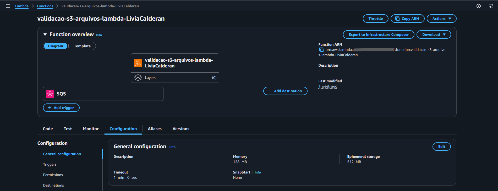

### 10. Processamento central de pedidos

Foi criada uma regra no EventBridge para capturar eventos `NovoPedidoValidado` e enviá-los para uma fila SQS Standard de pedidos pendentes. Essa fila aciona a Lambda de processamento central, que persiste o pedido na tabela principal do DynamoDB.

Configurações principais:

- Regra: `novo-pedido-validado-rule-seu-nome`
- Event bus: `pedidos-event-bus-seu-nome`
- Event pattern:

```json
{
  "source": ["lab.aula1.pedidos.validacao"],
  "detail-type": ["NovoPedidoValidado"]
}
```

- Fila principal: `pedidos-pendentes-queue-seu-nome`
- DLQ: `pedidos-pendentes-dlq-seu-nome`
- Lambda: `processa-pedidos-lambda-seu-nome`

### 11. DynamoDB principal de pedidos

Foi criada a tabela principal de pedidos para armazenar os pedidos processados e seus estados ao longo do ciclo de vida.

Configurações principais:

- Tabela: `pedidos-db-seu-nome`
- Partition key: `pedidoId`
- Uso: persistir dados do pedido, origem, status e timestamps
- Status inicial do processamento: `PEDIDO_PROCESSADO`

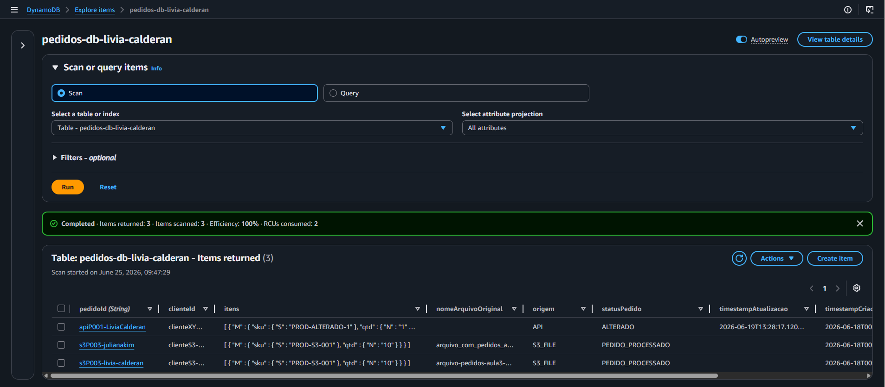

### 12. Lambda de processamento de pedidos

Foi criada a função `processa-pedidos-lambda-seu-nome`, acionada pela fila `pedidos-pendentes-queue-seu-nome`. Ela lê a estrutura do evento EventBridge, extrai o campo `detail` e grava o pedido na tabela principal do DynamoDB.

Configurações principais:

- Arquivo de código: `processa-pedidos-lambda.py`
- Runtime: Python 3.12
- Trigger: SQS Standard `pedidos-pendentes-queue-seu-nome`
- Variável de ambiente: `DYNAMODB_TABLE_NAME`
- Operação DynamoDB: `put_item`
- Campos gravados:
  - `pedidoId`
  - `clienteId`
  - `itens`
  - `statusPedido`
  - `origem`
  - `nomeArquivoOriginal`
  - `timestampCriacaoEvento`
  - `timestampProcessamento`

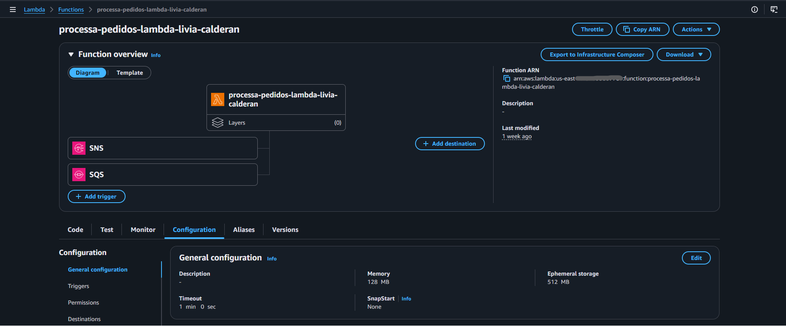

### 13. Fluxo de cancelamento de pedidos

Foi criado um fluxo adicional para cancelar pedidos já processados. O evento é enviado ao EventBridge e roteado para uma fila SQS dedicada, que aciona a Lambda de cancelamento.

Configurações principais:

- Regra: `cancela-pedido-rule-seu-nome`
- Fila principal: `cancela-pedido-queue-seu-nome`
- DLQ: `cancela-pedido-dlq-seu-nome`
- Lambda: `cancela-pedido-lambda-seu-nome`
- Event pattern:

```json
{
  "source": ["lab.aula4.operacoes"],
  "detail-type": ["CancelarPedido"]
}
```

Evento de teste:

```json
{
  "pedidoId": "ID_DO_PEDIDO"
}
```

A Lambda atualiza o campo `statusPedido` para `CANCELADO` e registra `timestampAtualizacao` na tabela `pedidos-db-seu-nome`.

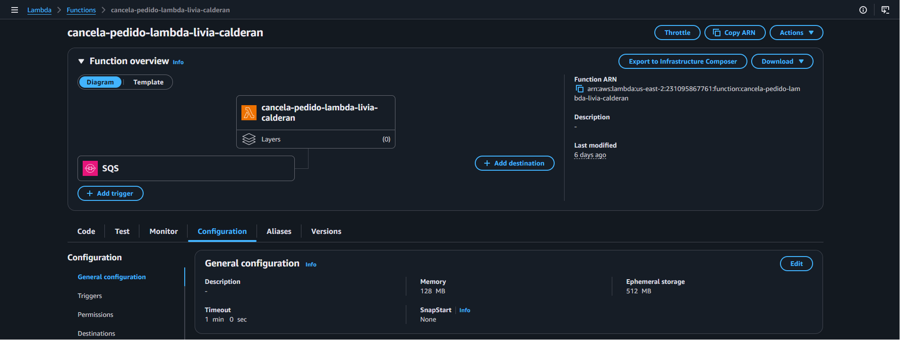

### 14. Fluxo de alteração de pedidos

Foi criado outro fluxo adicional para alterar os itens de um pedido existente. Assim como no cancelamento, o EventBridge roteia o evento para uma fila SQS dedicada e uma Lambda específica atualiza o item no DynamoDB.

Configurações principais:

- Regra: `altera-pedido-rule-seu-nome`
- Fila principal: `altera-pedido-queue-seu-nome`
- DLQ: `altera-pedido-dlq-seu-nome`
- Lambda: `altera-pedido-lambda-seu-nome`
- Event pattern:

```json
{
  "source": ["lab.aula4.operacoes"],
  "detail-type": ["AlterarPedido"]
}
```

Evento de teste:

```json
{
  "pedidoId": "ID_DO_PEDIDO",
  "novosItens": [
    {
      "sku": "PROD-ALTERADO-1",
      "qtd": 1
    },
    {
      "sku": "PROD-ALTERADO-2",
      "qtd": 99
    }
  ]
}
```

A Lambda atualiza os campos `itens`, `statusPedido` e `timestampAtualizacao` na tabela `pedidos-db-seu-nome`.

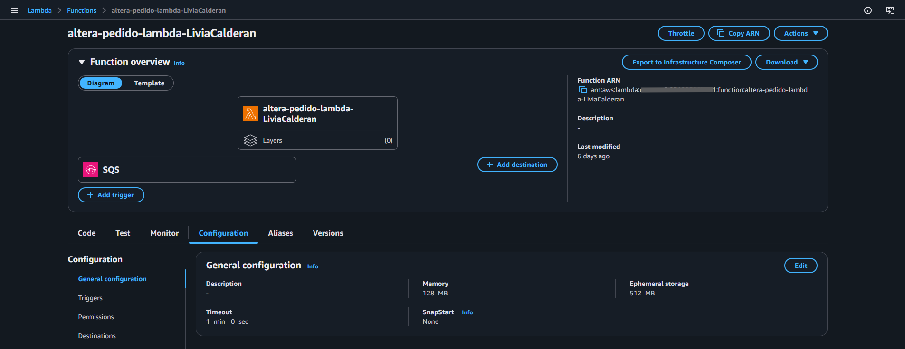

### 15. Validação de DLQs

As filas do laboratório foram configuradas com Dead Letter Queues para capturar mensagens que falham repetidamente durante o processamento.

DLQs configuradas:

- `pedidos-fifo-dlq-seu-nome.fifo`
- `s3-arquivos-json-dlq-seu-nome`
- `pedidos-pendentes-dlq-seu-nome`
- `cancela-pedido-dlq-seu-nome`
- `altera-pedido-dlq-seu-nome`

Para validar o comportamento, foi proposto forçar uma exceção na Lambda `processa-pedidos-lambda-seu-nome`, enviar um novo pedido e observar a mensagem sendo tentada novamente até ser movida para a DLQ `pedidos-pendentes-dlq-seu-nome`.

## Testes Realizados

### Teste via API

Foi enviada uma requisição `POST` para o endpoint `/pedidos`, contendo `pedidoId`, `clienteId` e uma lista de itens. O pedido foi recebido pelo API Gateway, processado pela Lambda de pré-validação, enviado para a fila FIFO, validado pela segunda Lambda e publicado no EventBridge.

Exemplo de payload:

```json
{
  "pedidoId": "apiP001-seu-nome",
  "clienteId": "clienteXYZ-seu-nome",
  "itens": [
    {
      "item": "Produto X API",
      "qtd": 1
    }
  ]
}
```

Validações:

- Resposta HTTP `200` da API
- Mensagem enviada para a fila FIFO
- Logs das Lambdas no CloudWatch
- Evento publicado no EventBridge
- Pedido persistido na tabela `pedidos-db-seu-nome`

### Teste via S3

Foi realizado upload de um arquivo JSON no bucket `datalake-arquivos-seu-nome`. A notificação do S3 foi entregue à fila SQS Standard, processada pela Lambda `validacao-s3-arquivos-lambda-seu-nome`, registrada no DynamoDB de controle e integrada ao fluxo principal pela fila FIFO de pedidos.

Exemplo de estrutura esperada:

```json
{
  "lista_pedidos": [
    {
      "id_pedido_arquivo": "s3P003-seu-nome",
      "id_cliente_arquivo": "clienteS3-ABC",
      "itens_pedido_arquivo": [
        {
          "sku": "PROD-S3-001",
          "qtd": 1
        }
      ]
    }
  ]
}
```

Validações:

- Arquivo recebido no S3
- Evento entregue à fila SQS de arquivos
- Registro criado na tabela `controle-arquivos-historico-seu-nome`
- Pedido extraído e enviado à fila FIFO principal
- Pedido persistido na tabela `pedidos-db-seu-nome`

### Teste de cancelamento

Foi enviado um evento manual pelo console do EventBridge com `source` igual a `lab.aula4.operacoes` e `detail-type` igual a `CancelarPedido`. A regra de cancelamento enviou a mensagem para a fila dedicada e a Lambda atualizou o pedido no DynamoDB.

Validações:

- Mensagem roteada para `cancela-pedido-queue-seu-nome`
- Lambda `cancela-pedido-lambda-seu-nome` invocada
- Campo `statusPedido` atualizado para `CANCELADO`

### Teste de alteração

Foi enviado um evento manual pelo console do EventBridge com `source` igual a `lab.aula4.operacoes` e `detail-type` igual a `AlterarPedido`. A regra de alteração enviou a mensagem para a fila dedicada e a Lambda atualizou os itens do pedido no DynamoDB.

Validações:

- Mensagem roteada para `altera-pedido-queue-seu-nome`
- Lambda `altera-pedido-lambda-seu-nome` invocada
- Campo `statusPedido` atualizado para `ALTERADO`
- Campo `itens` substituído pela nova lista enviada no evento

## Evidências Visuais

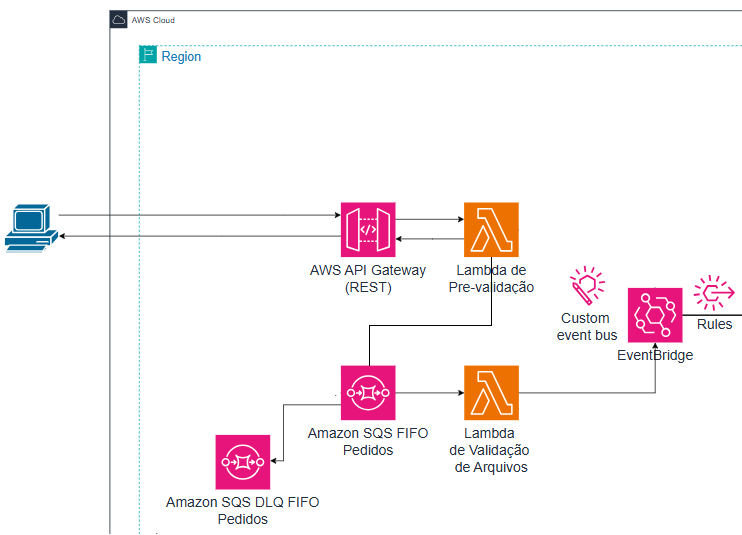

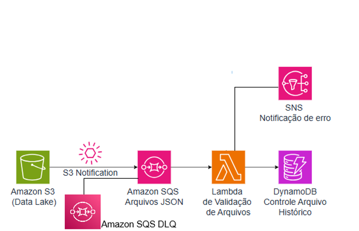

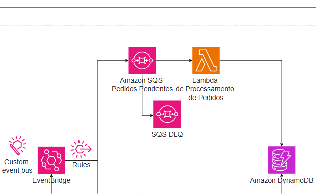

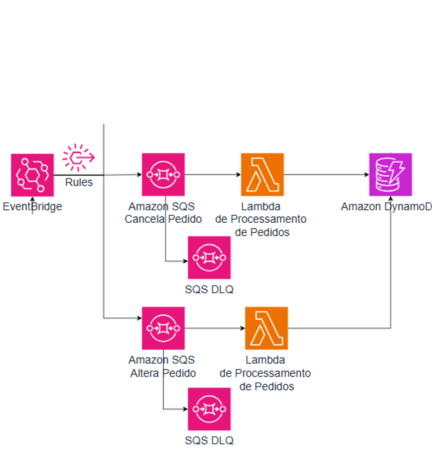

## Arquivos de Código

Os códigos das funções Lambda utilizadas no laboratório estão versionados nesta pasta:

- `pre-validacao-lambda.py`
- `validacao-pedidos-lambda.py`
- `validacao-s3-arquivos-lambda.py`
- `processa-pedidos-lambda.py`
- `cancela-pedido-lambda.py`
- `altera-pedido-lambda.py`

## Resultado

O laboratório foi concluído com sucesso. A arquitetura final recebe pedidos por API Gateway e por arquivos S3, utiliza filas SQS para desacoplamento, publica eventos em um barramento customizado do EventBridge, processa pedidos por funções Lambda e persiste o estado no DynamoDB.

Também foram implementados fluxos adicionais de alteração e cancelamento, além de DLQs para aumentar a resiliência do processamento assíncrono e permitir análise de mensagens com falha.

## Conhecimentos Praticados

- Criação de APIs REST com Amazon API Gateway
- Integração entre API Gateway e AWS Lambda
- Desenvolvimento de funções Lambda em Python
- Uso de variáveis de ambiente em Lambda
- Criação de filas SQS FIFO e Standard
- Configuração de Dead Letter Queues
- Uso de `MessageGroupId` e `MessageDeduplicationId` em filas FIFO
- Criação de barramento customizado no Amazon EventBridge
- Publicação de eventos customizados com `events:PutEvents`
- Criação de regras no EventBridge com event patterns
- Roteamento de eventos para filas SQS
- Ingestão de arquivos JSON com Amazon S3
- Notificações de eventos do S3 para SQS
- Registro de histórico e persistência com Amazon DynamoDB
- Envio de notificações de erro com Amazon SNS
- Configuração de IAM Roles e políticas inline
- Validação de logs no Amazon CloudWatch
- Construção de arquitetura serverless orientada a eventos

## Conclusão

Este lab demonstrou como combinar API Gateway, Lambda, SQS, EventBridge, S3, DynamoDB e SNS para construir uma solução serverless completa de processamento de pedidos.

A arquitetura resultante é desacoplada, extensível e resiliente. Novas fontes de entrada podem ser integradas ao pipeline principal, novos tipos de evento podem ser adicionados por regras no EventBridge e falhas de processamento podem ser isoladas em DLQs para investigação posterior.

O laboratório também reforçou práticas importantes para aplicações cloud native, como processamento assíncrono, separação de responsabilidades, rastreabilidade por logs, persistência de estado e tratamento de falhas em sistemas distribuídos.
